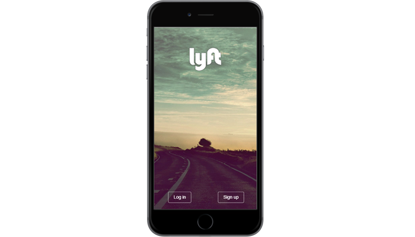

# Proyecto "Lyft"

Lyft es una aplicación de servicio de taxi a través de dispositivos móviles.

***

### Descripción del proyecto:

La aplicación muestra el proceso de registro del usuario y la verificación de los datos proporcionados.

#### Flujo del Proyecto:

##### Vista del home:
Esta vista es donde se da opción al usuario de registrarse.

##### Vista del log-in:
El usuario ingresa su número telefonico y se envía un mensaje de texto con el código aletorio. (en este caso saldrá un ventana emergente.)

##### Vista de verificación:
En esta vista se verifica el código que se envió al usuario, pues este debe ser ingresado. Si este coincide con el dado, el botón "next" se activa. 
El usuario tiene la opción de pedir un nuevo código mediante el botón de reenvío.
Una vez que el código este verificado, el botón "next", muestra la vista de registro.

##### Vista de resgistro:
El usuario ingresa sus datos: nombre, apellido y correo electrónico.
Los inputs se encuentran deshabilitados a menos que se llene el anterior correctamente.
Además el usuario debe marcar un checkbox, mediante el cual acepta las condiciones de Lyft.
Una vez todos los campos estén llenados correctamente el botón "next" se activa y lleva al usuario a la siguiente vista.

##### Vista del mapa:
En esta vista tenemos el mapa de google con la ubicación actual del usuario, ademas tenemos un input donde podemos ingresar la direccion hacia donde queramos dirigirnos luego de dar click en el botón 'set pickup'.

***

### Herramientas utilizadas:

1. HTML5

2. CSS3

3. Javascript

4. jQuery

5. Bootstrap.